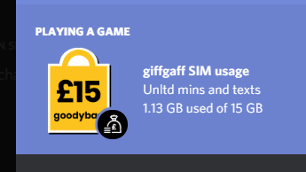
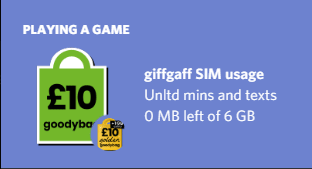

# giffgaff Discord Rich Presence

Show your giffgaff SIM usage in Discord!

[View changelog](CHANGELOG.md)

## Setup

1. Clone the repo/Download the ZIP
2. Copy `src/Config/config.default.json` to `src/Config/config.json`
3. Put your username and password in the config
4. Install dependencies (`yarn install`)
5. Run (`yarn start`)
6. ???
7. Profit.

**Note:** the app token needed for all this to work is NOT included. This is for this repo's safety. If you want to use this, find it yourself using a man-in-the-middle proxy (or some other method).

The token you need is the one included in the `Authorization` header to the OAuth API, preceded with `Basic`, **not** `Bearer`. Stick it in your `config.json`.

## Known issues

- Extra GB disappears once depleted [(#2)](https://github.com/davwheat/giffgaff-rich-presence/issues/2)

## About

### How does this work?

It uses the giffgaff app's authentication token to communicate with the giffgaff GraphQL API.

The GraphQL API _can_ expose lot of info about your account, including email, phone number, SIM serial number, and far more. If the phishers got a hand of the API, they wouldn't need to steal member's data by getting them to input it. Instead, just their membername and password is enough, and all the info extract

### Am I allowed to do this?

Maybe? The API endpoint is located at `publicapi.giffgaff.com`, and [giffgaff Labs](https://labs.giffgaff.com/idea/23121/giffgaff-api) says that an API has been implemented, but they just haven't given any documentation.

I got the app's token by looking at my own internet traffic, not by decompiling the app or anything else silly.

**If giffgaff actually decided to implement their member's ideas properly, this ridiculous method wouldn't be needed.** Even just allowing members to generate their own API keys which can only access their account would be **AMAZING**!

## Configuration

|       Field       |     Default     | Description                                                                        |
| :---------------: | :-------------: | ---------------------------------------------------------------------------------- |
|   `membername`    |  `"mrcoolman"`  | Your giffgaff membername                                                           |
|    `password`     | `"password123"` | Your giffgaff password                                                             |
| `refreshInterval` |      `30`       | Amount of mins between usage updates[1]                                 |
|   `oauthToken`    |  `<nonsense>`   | Set this to the Basic token used by the giffgaff app                               |
|      `debug`      |     `false`     | Logs extra content to console. May expose sensitive data, such as your auth token. |

[1] - Don't go too low with this or you might trigger some form of spam prevention. 30 minutes seems reasonable to me. To be extra safe, you can bump it to 60 mins. If you're a risk taker, maybe try 10 or 15.
